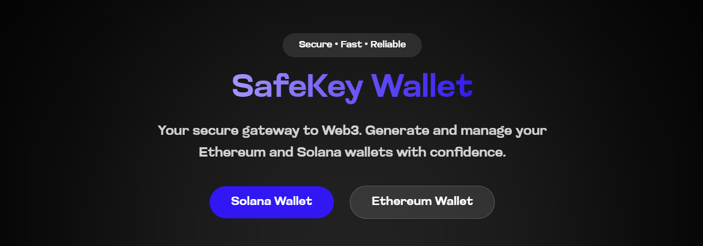

# SafeKey Wallet


SafeKey Wallet is a secure and user-friendly web application for generating and managing Ethereum and Solana wallets.The application provides features such as generating seed phrases, recovering wallets, Built with Next.js, this project leverages modern web technologies to provide a seamless experience for users.


## Getting Started

### Prerequisites

Ensure you have the following installed on your machine:

- Node.js (v14 or higher)
- npm (v6 or higher) or yarn (v1.22 or higher)

### Installation

1. Clone the repository:

```bash
git clone https://github.com/your-username/safekey-wallet.git
cd safekey-wallet
```

2. Install the dependencies:

```bash
npm install
# or
yarn install
```

### Running the Development Server

Start the development server:

```bash
npm run dev
# or
yarn dev
# or
pnpm dev
# or
bun dev
```

Open [http://localhost:3000](http://localhost:3000) with your browser to see the result.

You can start editing the page by modifying 

page.tsx

. The page auto-updates as you edit the file.

### Building for Production

To create an optimized production build:

```bash
npm run build
# or
yarn build
```

### Running the Production Server

After building the project, you can start the production server:

```bash
npm start
# or
yarn start
```

## Learn More

To learn more about Next.js, take a look at the following resources:

- [Next.js Documentation](https://nextjs.org/docs) - learn about Next.js features and API.
- [Learn Next.js](https://nextjs.org/learn) - an interactive Next.js tutorial.

You can check out [the Next.js GitHub repository](https://github.com/vercel/next.js) - your feedback and contributions are welcome!

## Deploy on Vercel

The easiest way to deploy your Next.js app is to use the [Vercel Platform](https://vercel.com/new?utm_medium=default-template&filter=next.js&utm_source=create-next-app&utm_campaign=create-next-app-readme) from the creators of Next.js.

Check out our [Next.js deployment documentation](https://nextjs.org/docs/app/building-your-application/deploying) for more details.